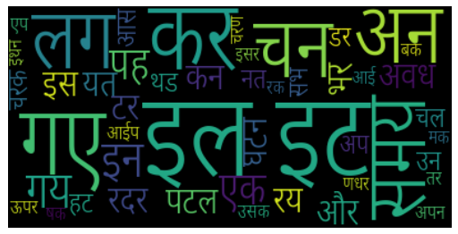

# WordCloud
Word cloud creation for Devanagari script texts.

- Here you'll find broken words in the cloud image.

Next worK:
- The words don't appear together in the cloud, hence need new tokenization.
- Add more fonts for larger variety of support.

-----------------------------------------------
#### Requirements (libraries) ####
- Python3
- matplotlib
- wordcloud
- bidi.algorithm (for display)
- codecs

#### To run ####
- Keep the font in the same directory as the cloud.py or change the path of `.ttf` file.
- Run `python3 cloud.py`

---------------------------------------------

## Example ##

